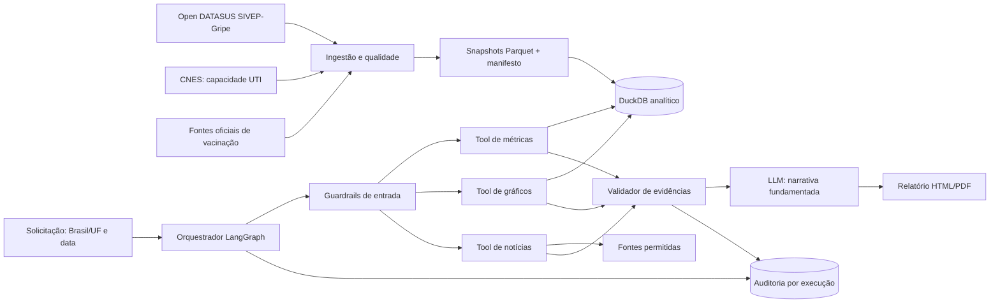

# Design da PoC de relatórios de SRAG

> Status: aprovado para detalhamento em SDD  
> Data: 2026-07-28  
> Escopo geográfico: Brasil, com filtro opcional por UF

## 1. Objetivo

Construir uma PoC em Python que gere relatórios epidemiológicos automatizados sobre Síndrome Respiratória Aguda Grave (SRAG). Um orquestrador LangGraph consulta tools restritas para obter métricas de dados públicos, gráficos determinísticos e notícias atuais. O LLM redige explicações somente a partir dessas evidências estruturadas.

A PoC deve demonstrar viabilidade, não oferecer diagnóstico, previsão epidemiológica ou recomendação clínica.

## 2. Correspondência com o desafio

| Requisito do desafio | Decisão de design |
|---|---|
| Agente consulta banco de dados | Orquestrador LangGraph chama tools analíticas parametrizadas sobre DuckDB. |
| Agente consulta notícias em tempo real | Tool de notícias consulta fontes permitidas e retorna título, URL, fonte, data e trecho. |
| Taxa de aumento de casos | Variação entre os últimos sete dias e os sete dias anteriores. |
| Taxa de mortalidade | Letalidade entre internações SRAG com evolução conhecida; a nomenclatura metodológica evita confundi-la com mortalidade populacional. |
| Taxa de ocupação de UTI | Ocupação estimada de leitos UTI por pacientes SRAG, combinando permanência em UTI do SIVEP-Gripe e capacidade mensal do CNES. |
| Taxa de vacinação | Coberturas independentes contra influenza e COVID-19, com população-alvo, esquema, fonte e período próprios. |
| Gráficos de 30 dias e 12 meses | Renderer determinístico usa os mesmos agregados validados das métricas. |
| Dados reais e problemáticos | Pipeline seleciona colunas, normaliza, deduplica, valida e quantifica perdas e completude. |
| Governança e transparência | Run ID, snapshots, parâmetros, tool calls, versões, fontes, decisões e falhas são auditados. |
| Guardrails | Schemas fechados, consultas somente leitura, allowlists, limites de execução, validação de evidência e política de linguagem. |
| Dados sensíveis | Minimização na ingestão; o agente, o LLM, os logs e o relatório recebem somente agregados. |
| Clean Code | Domínios isolados por interfaces: ingestão, métricas, tools, orquestração, auditoria e apresentação. |
| README e PDF de arquitetura | Artefatos obrigatórios da última etapa de entrega. |

## 3. Arquitetura

### 3.1 Limites dos módulos

- **Ingestão:** baixa ou recebe fontes, preserva o bruto fora do runtime do agente, valida schema, normaliza valores, elimina colunas desnecessárias e materializa snapshots imutáveis.
- **Camada analítica:** expõe fatos e agregados temporais/geográficos em DuckDB. Não expõe registros individuais ao agente.
- **Métricas:** implementa fórmulas versionadas e retorna objetos estruturados com numerador, denominador, unidade, período, geografia, fonte e qualidade.
- **Tools:** adaptadores estreitos e tipados. Não haverá tool genérica `execute_sql` nem acesso livre à web.
- **Orquestrador:** valida a solicitação, chama tools em ordem controlada, avalia suficiência das evidências, solicita narrativa ao LLM e entrega o renderer.
- **LLM:** comenta tendências e contexto; não calcula, consulta registros individuais, cria URLs ou altera números.
- **Renderer:** monta o documento com valores estruturados e gráficos; números não são extraídos do texto do LLM.
- **Auditoria:** mantém trilha reproduzível sem armazenar dados pessoais.

## 4. Fluxo principal

1. Operador atualiza fontes ao vivo ou escolhe snapshots locais para uma demonstração reproduzível.
2. Pipeline gera manifesto com origem, horário, hash, schema, contagens, rejeições e data máxima válida.
3. Usuário solicita relatório para Brasil ou uma UF e uma data de referência.
4. Guardrail valida UF, data e limites de execução.
5. Orquestrador obtém as quatro categorias de métricas, duas séries gráficas e notícias recentes.
6. Validador confere proveniência, unidade, período, qualidade e citações.
7. LLM recebe somente o pacote de evidências aprovado e produz comentários sem causalidade não demonstrada.
8. Renderer gera relatório com metodologia, limitações, fontes, timestamps e run ID.
9. Auditoria persiste eventos e decisões suficientes para reproduzir a execução.

## 5. Definições das métricas

### 5.1 Aumento de casos

$$
\frac{casos_{D-6:D} - casos_{D-13:D-7}}{casos_{D-13:D-7}} \times 100
$$

A data epidemiológica será a data de início dos sintomas quando válida. Registros sem essa data não entram na série principal. Denominador zero produz estado categórico documentado, nunca infinito.

### 5.2 Letalidade entre internações SRAG

$$
\frac{óbitos\ por\ SRAG}{internações\ com\ evolução\ conhecida} \times 100
$$

Evoluções ausentes ou ignoradas ficam fora do denominador e sua quantidade aparece na qualidade da métrica. O rótulo de apresentação pode mencionar “taxa de mortalidade solicitada”, mas a definição visível deve dizer “letalidade hospitalar”, tecnicamente compatível com o denominador disponível.

### 5.3 Ocupação estimada de UTI por SRAG

$$
\frac{paciente\text{-}dias\ de\ SRAG\ em\ UTI}{leito\text{-}dias\ de\ UTI\ disponíveis} \times 100
$$

O numerador deriva da sobreposição entre entrada/saída em UTI e o período. O denominador usa capacidade mensal aplicável do CNES, com regra documentada para categorias de leito e agregação Brasil/UF. Sem capacidade compatível, a ocupação fica indisponível; o sistema pode mostrar separadamente a proporção de internações com uso de UTI, sem renomeá-la como ocupação.

### 5.4 Coberturas vacinais

O relatório apresenta dois indicadores, sem média entre eles:

- **Influenza:** doses válidas no público-alvo da campanha divididas pela população-alvo oficial da campanha.
- **COVID-19:** pessoas com o esquema definido pela fonte oficial divididas pela população elegível correspondente.

Cada resultado inclui vacina, esquema/dose, público-alvo, período, geografia, fonte e data de atualização. Uma cobertura ausente não bloqueia a outra.

## 6. Dados e qualidade

A seleção definitiva de campos seguirá o dicionário da edição usada do SIVEP-Gripe. O conjunto mínimo deve cobrir data de sintomas, internação, entrada/saída de UTI, evolução, UF e chave técnica para deduplicação. Identificadores e atributos sem função analítica serão descartados antes da camada consumida pelo agente.

Regras mínimas:

- datas impossíveis, futuras ou com ordem temporal inválida são rejeitadas ou anuladas conforme regra por campo;
- códigos ignorados não são convertidos em “não”;
- duplicatas seguem uma chave e precedência documentadas;
- UF inválida vai para quarentena;
- ausência afeta apenas métricas dependentes daquele campo;
- cada métrica expõe completude, quantidade incluída/excluída e motivo de indisponibilidade;
- snapshots ao vivo e locais usam o mesmo contrato e são identificados por hash.

## 7. Guardrails e segurança

- Entrada aceita somente Brasil ou siglas oficiais de UF, data ISO e janela de notícias limitada.
- Tools usam modelos tipados e consultas parametrizadas, somente leitura.
- O runtime do agente não recebe chaves técnicas, nomes, endereços ou registros linha a linha.
- Busca de notícias limita domínios/fontes e exige URL, veículo e data de publicação.
- Prompt e validador proíbem diagnóstico, recomendação clínica, causalidade sem evidência e números fora do pacote estruturado.
- Falta de evidência gera indisponibilidade explícita, não fallback inventado.
- Execução limita quantidade de tool calls, tentativas, tokens e tempo.
- Segredos ficam em ambiente local e nunca no repositório ou log.

## 8. Auditoria e observabilidade

Cada execução registra:

- run ID e timestamps;
- filtros e data de referência;
- IDs e hashes dos snapshots;
- nome, versão, entrada resumida, saída resumida, duração e estado de cada tool;
- versão das fórmulas, prompt e modelo;
- URLs e datas das notícias usadas;
- verificações de guardrail e decisões do grafo;
- artefatos gerados e falhas.

Logs não armazenam registros individuais nem conteúdo sensível. O relatório mostra run ID e marcos de atualização; o log detalhado permanece em artefato local estruturado.

## 9. Falhas e degradação controlada

- Sem notícia válida: gera relatório quantitativo e declara ausência de contexto jornalístico verificável.
- Sem uma cobertura vacinal: mostra a outra e explica a indisponibilidade.
- Sem capacidade CNES compatível: não publica ocupação; apresenta somente indicador auxiliar claramente nomeado, se válido.
- Completude abaixo do limiar da métrica: resultado indisponível com cobertura e motivo.
- Falha do LLM: preserva um relatório factual mínimo com métricas, gráficos, fontes e limitações.
- Snapshot inválido ou incompatível: interrompe antes do agente e registra falha de ingestão.

## 10. Testes e evidência

- Contratos e fórmulas: testes unitários com denominadores zero, ausentes, datas de fronteira e agregação Brasil/UF.
- Ingestão: fixtures com códigos inválidos, duplicatas, datas invertidas e evolução ignorada.
- Integração: DuckDB + tools + auditoria usando snapshots pequenos e determinísticos.
- Orquestração: LLM fake somente nos testes do grafo; valida tool order, bloqueios e degradação.
- Fim a fim: geração de um relatório Brasil e um relatório UF contendo quatro categorias de métricas, dois gráficos, fontes e run ID.
- Smoke test final: executar a aplicação com snapshots demonstrativos e abrir o relatório renderizado.

## 11. Decomposição SDD

1. `01-data-foundation`: ingestão, qualidade, minimização, snapshots e DuckDB.
2. `02-epidemiological-metrics`: fórmulas, Brasil/UF, séries e gráficos.
3. `03-agentic-reporting`: tools, notícias, LangGraph, evidências, LLM e renderer.
4. `04-governance-delivery`: auditoria, guardrails transversais, documentação, diagrama PDF e execução fim a fim.

Cada pasta conterá `spec.md`, `acceptance.feature` e `tasks.md`. `spec.md` será a fonte de verdade; requisitos, cenários e tarefas terão IDs rastreáveis.

## 12. Não objetivos

- Diagnóstico, triagem ou recomendação médica.
- Predição de surtos ou inferência causal.
- Dashboard multiusuário, autenticação ou implantação em produção.
- Consulta livre a SQL, internet ou registros individuais pelo LLM.
- Banco vetorial sem necessidade demonstrada; notícias recentes cabem no pacote de evidências e não justificam RAG persistente na PoC.

## 13. Decisões encerradas

- Brasil por padrão e filtro opcional por UF.
- Fontes ao vivo com snapshots locais versionados.
- LangGraph com tools restritas e cálculos determinísticos.
- Coberturas de influenza e COVID-19 independentes.
- Ocupação estimada de UTI baseada em paciente-dias e capacidade CNES; proporção de uso é apenas auxiliar.
- Relatório degradável, mas nunca preenchido com dados sintéticos.
